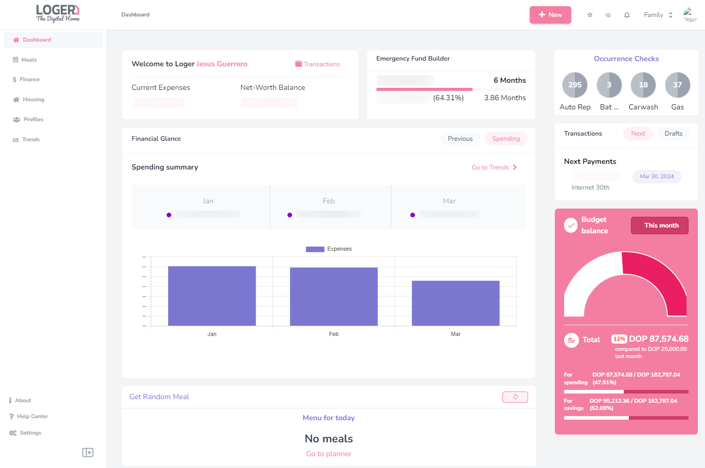

<p align="center">
  <a href="https://loger.neatlancer.com" target="_blank" rel="noopener noreferrer">
    
  </a>
</p>

<h3 align="center">
    The Digital Home Management Software
</h3>

 <p align="center">
	<strong>
		<a href="https://loger.vercel.app/" target="_blank">Website</a>
		•
		<a href="https://loger.neatlancer.com" target="_blank">Demo</a>
	</strong>
</p>



## About Loger

Loger (_House_ in French) — managing a family and home is almost like being CEO of a company. Budgeting, expenses, subscriptions, savings goals, emergency funds, meal planning, grocery lists... we all do it in our heads, on paper, or scattered across multiple apps.

Loger is the central point to manage all of that and more. Built for people who want real budgeting tools — especially those outside the US where bank-sync services like Plaid don't exist.

## Features

Loger is organized in **concerns** (modules you can enable/disable per team):

### 💵 Finance
- Monthly Budget (YNAB-style envelope budgeting)
- Accounts & Transactions (multi-currency support)
- Bank statement import (PDF)
- Account Reconciliation
- Emergency Funds & Savings Goals
- Net Worth tracking & Trends
- Credit Card management
- Watchlists

### 🍗 Meal Planner
- Recipes & Ingredients
- Weekly Meal Planner
- Random Meal Generator
- Shopping Lists

### 🏡 Housing
- Chores & Occurrence Checks
- Equipment tracking
- Plans (events, repairs, activities)

### 👨‍👩‍👧 Relationships
- Family member profiles
- Activity tracking & reminders

## Tech Stack

Loger is a monolith built with:
- **Backend**: Laravel 11, Jetstream, Sanctum, Fortify
- **Frontend**: Vue 3, Inertia.js v1, Tailwind CSS 3, Pinia
- **Custom packages**: [Atmosphere UI](https://github.com/jesusantguerrero/atmosphere-ui), [Journal](https://github.com/insane-code/journal)

## Demo

View a live [demo here](https://loger.neatlancer.com), or deploy your own instance to DigitalOcean:

<a href="https://cloud.digitalocean.com/apps/new?repo=https://github.com/jesusantguerrero/atmosphere/tree/master" target="_blank">
 
</a>

## Requirements

| Prerequisite                                          | Version      |
|-------------------------------------------------------|------------- |
| [PHP](https://www.php.net/)                           | `>= 8.2`     |
| [Composer](https://getcomposer.org/)                  | `>= 2.3`     |
| [Node.js](http://nodejs.org)                          | `>= 20`      |
| npm                                                   | `>= 9`       |
| [MariaDB](https://mariadb.org/) or MySQL 8            | `>= 10.8`    |
| PHP extension ext-mailparse *(optional)*              | —            |
| [Google Cloud Project](https://developers.google.com/gmail/api/quickstart/js) *(optional, for Gmail integration)* | — |

## Installation

```bash
git clone https://github.com/jesusantguerrero/atmosphere.git loger
cd loger
```

### 1. Configure environment

```bash
cp .env.example .env
```

Edit `.env` with your database credentials and app URL:

```env
APP_URL=http://127.0.0.1:8000
DB_CONNECTION=mysql
DB_HOST=127.0.0.1
DB_PORT=3306
DB_DATABASE=loger
DB_USERNAME=root
DB_PASSWORD=
```

### 2. Install dependencies

```bash
composer install --ignore-platform-reqs
```

### 3. Run the installer

```bash
npm run app:install
```

### 4. Add sample data (optional)

```bash
php artisan app:demo-seed
```

### 5. Start developing

```bash
# Backend
php artisan serve

# Frontend (in a separate terminal)
npm run dev
```

Visit `http://127.0.0.1:8000` and you're up and running.

## License

[BSD-3 license](https://github.com/jesusantguerrero/atmosphere/blob/master/LICENSE).

## Author

Jesus Guerrero
- [jesusantguerrero.com](https://jesusantguerrero.com)
- [@jesusntguerrero](https://twitter.com/jesusntguerrero)
